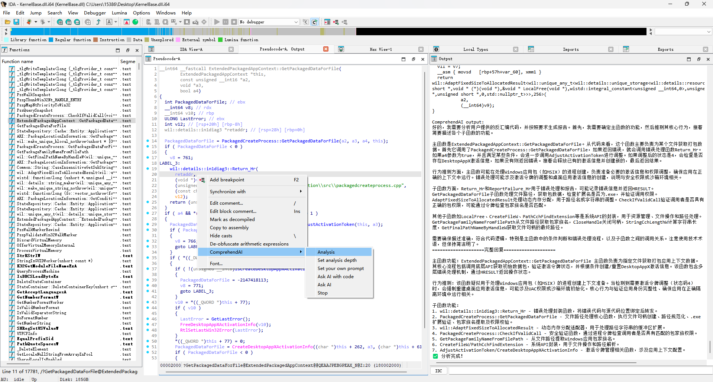
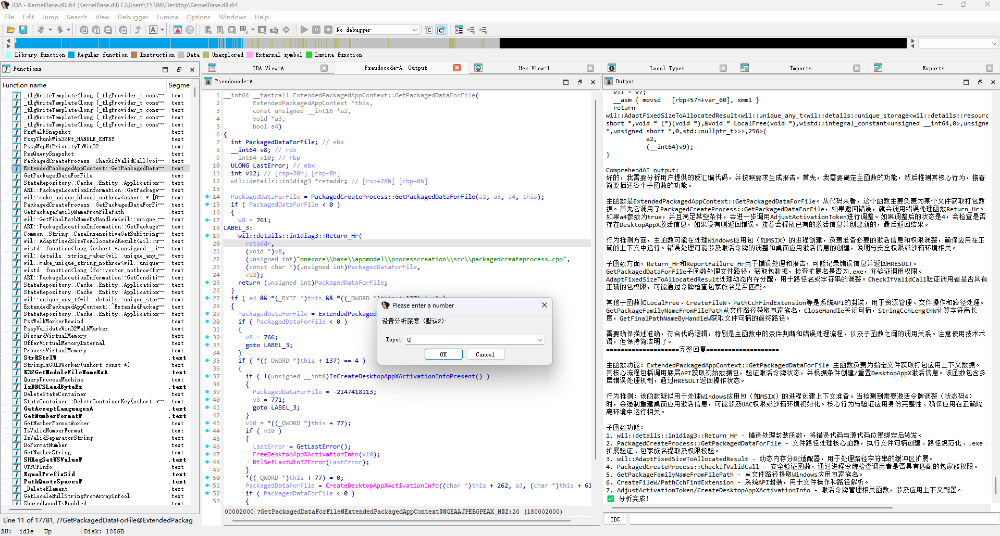
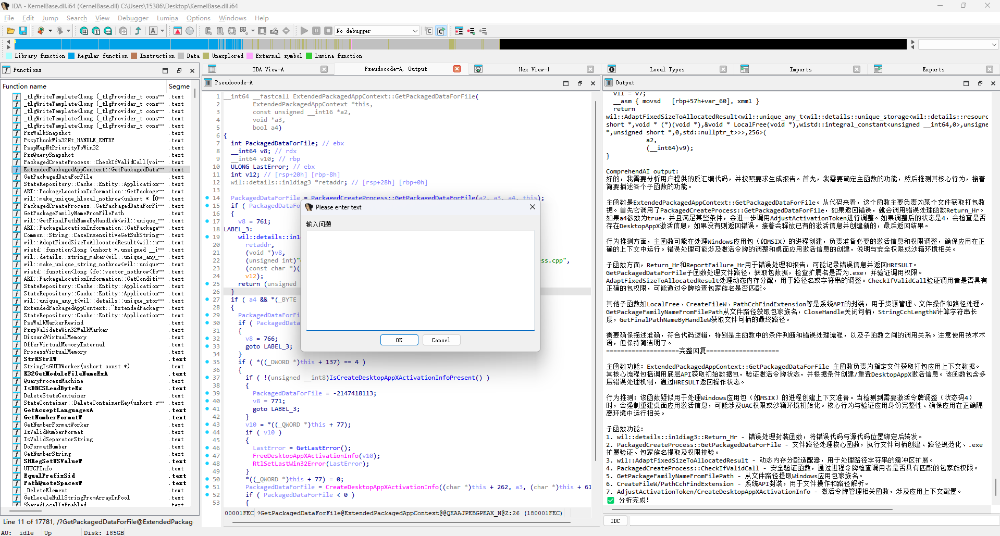
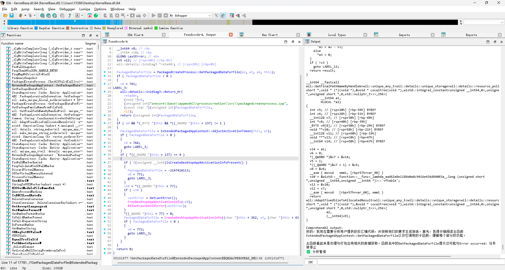
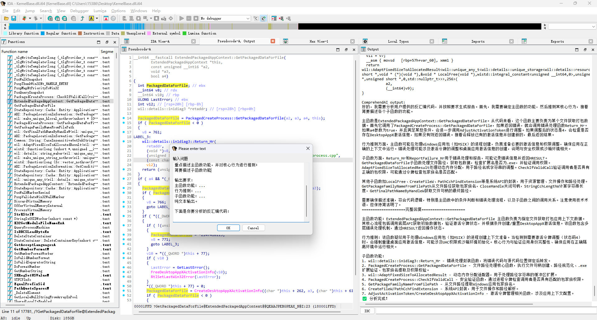

# ComprehendAI

An AI plugin for assisting IDA reverse analysis, which facilitates quickly summarizing the functions of code and accelerates the analysis efficiency.

## Features

**Non - blocking AI Analysis**

- Description: This feature enables non - blocking AI analysis. While the analysis is in progress, you can continue with your work uninterrupted. Once the analysis is completed, the results will be printed in the output window.

**Customizable Function Analysis Depth**

- Description: You have the flexibility to set the depth of function analysis according to your needs. 

**Manual Interaction with AI**

- Description: You can manually ask the AI various questions and perform any operations you prefer. 

**Support for Streaming Output with Inference Models**

- Description: Supports the use of inference models with streaming output.  Get continuous results as the model processes data.


## Usage

#### 1. Project Retrieval

First, you need to pull the project to your local machine. Open your terminal or command prompt and use the following command to clone the project repository:

```bash
git clone https://github.com/wang-zhibo/ComprehendAI.git
```

#### 2. File Placement

Navigate to the directory of the cloned project. Locate the `config.json` and `ComprehendAI.py` files. Then, place these two files into the `plugins` folder of IDA . 

#### 3. Configuration File Setup

Open the `config.json` file. You will see a content structure similar to the following:

```json
{
    "openai"{
        "model":"",
        "api_key": "",
        "base_url": ""
    }
}
```

Replace the content within the double - quotes with your own `api_key` and `base_url`. For example:

```json
{
    "openai"{
        "model":"",
        "api_key": "your_actual_api_key",
        "base_url": "your_actual_base_url"
    }
}
```

Save and close the `config.json` file.

#### 4. Dependencies

You need to install the following Python libraries using `pip`. You can install the `openai` library with the following command:

```py
pip install openai
```

#### 4. Launch IDA and Load the Plugin

It has been successfully tested in IDA 9.1 and IDA 7.7.

###  Example

Right - click on the disassembly window to pop up the menu and select a function.

Analysis allows you to continue your work, and then the results will be printed in the output window.



You can set the depth of function analysis by yourself. If you're only interested in the current function or you have to consider the tokens consumption, just set the depth to 0.



You can also manually ask the AI some questions and do whatever you like,Or ask questions while referring to the code. 



You can easily pause the output whenever you want.  



You have the freedom to customize the prompt according to your needs for the moment.



