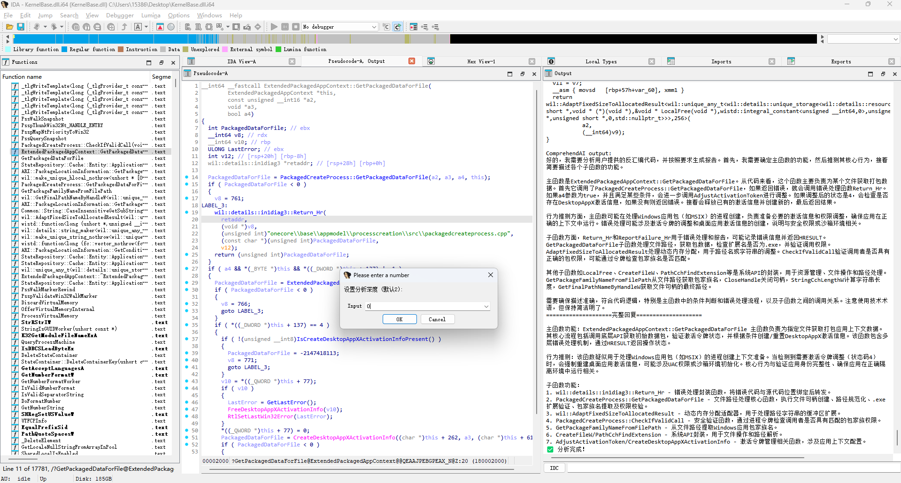

# ComprehendAI

一个用于辅助 IDA 逆向分析的 AI 插件，可以快速总结代码功能，加速分析效率。

> **最新更新（2025-10-24）**: 代码已全面优化，包括更完善的错误处理、更友好的中文提示、更美观的输出格式。详见 [OPTIMIZATION_NOTES.md](./OPTIMIZATION_NOTES.md) 和 [CODE_COMPARISON.md](./CODE_COMPARISON.md)

## 功能特性

### 🚀 非阻塞式 AI 分析
- 分析过程不会阻塞你的工作
- 分析完成后结果会自动打印到输出窗口
- 可随时停止正在运行的分析任务

### ⚙️ 可自定义的函数分析深度
- 灵活设置函数分析的递归深度
- 深度为 0 时只分析当前函数
- 深度越大，分析的子函数层级越多

### 💬 手动与 AI 交互
- 可以直接向 AI 提问
- 支持结合当前代码向 AI 提问
- 自由进行任何你想要的操作

### 📝 自定义提示词
- 支持自定义分析提示词模板
- 可根据不同需求调整分析重点

### 🌊 支持流式输出
- 支持使用具有流式输出功能的推理模型
- 实时获取 AI 的分析结果

## 安装使用

### 1. 克隆项目

首先，将项目克隆到本地：

```bash
git clone https://github.com/wang-zhibo/ComprehendAI.git
```

### 2. 放置文件

进入克隆的项目目录，找到 `ComprehendAI.py` 文件，将其放入 IDA 的 `plugins` 文件夹中。

```
path
🦉 [plugins] pwd                                                            15:59:06
/Applications/IDA Professional 9.2.app/Contents/MacOS/plugins
🦉 [plugins] cp ~/wangzhib_githubs/ComprehendAI/ComprehendAI.py .
```

**重要提示**：不要直接使用 `config_sample.json`，而是需要创建自己的 `config.json` 文件。

### 3. 配置文件设置

在 IDA 的 `plugins` 文件夹中创建一个新的 `config.json` 文件，内容格式如下：

```json
{
    "openai": {
        "model": "你的模型名称",
        "api_key": "你的API密钥",
        "base_url": "你的API地址"
    }
}
```

**配置示例：**

使用 OpenAI 官方 API：
```json
{
    "openai": {
        "model": "gpt-4",
        "api_key": "sk-xxxxxxxxxxxxxxxx",
        "base_url": "https://api.openai.com/v1"
    }
}
```

使用其他兼容 OpenAI 格式的 API（如 DeepSeek、通义千问等）：
```json
{
    "openai": {
        "model": "deepseek-chat",
        "api_key": "你的API密钥",
        "base_url": "https://api.deepseek.com/v1"
    }
}
```

使用本地 Ollama：
```json
{
    "openai": {
        "model": "qwen2.5:14b",
        "api_key": "ollama",
        "base_url": "http://localhost:11434/v1"
    }
}
```

### 4. 安装依赖

安装所需的 Python 库：

```bash
pip install openai
```

### 5. 启动 IDA 并加载插件

插件已在 IDA 9.1 和 IDA 7.7 上成功测试。

启动 IDA 后，插件会自动加载。如果加载成功，你会在输出窗口看到：

```
================================================================================
✅ ComprehendAI 插件已成功加载
================================================================================
```

## 使用方法

### 1. AI 智能分析

在反汇编窗口或伪代码窗口中，右键点击函数，选择 `ComprehendAI` -> `🤖 AI 分析`。

插件会自动提取当前函数及其调用的子函数的反编译代码，然后发送给 AI 进行分析。


### 2. 设置分析深度

右键选择 `ComprehendAI` -> `⚙️ 设置分析深度`。

- **深度 0**：只分析当前函数，不包含子函数（节省 token）
- **深度 1**：分析当前函数及其直接调用的子函数
- **深度 2**（默认）：分析当前函数、子函数及子函数的子函数
- 以此类推...



### 3. 带代码提问

右键选择 `ComprehendAI` -> `💬 带代码提问`。

输入你的问题，插件会将当前函数的代码和你的问题一起发送给 AI。

适用场景：
- "这个函数有什么安全漏洞吗？"
- "这段代码的时间复杂度是多少？"
- "帮我找出这个函数中的关键逻辑"

### 4. 直接提问

右键选择 `ComprehendAI` -> `💭 直接提问`。

直接向 AI 提问，不附带代码。

适用场景：
- "解释一下 ROP 攻击的原理"
- "什么是栈溢出？"
- 任何与逆向分析相关的问题


### 5. 停止分析

如果 AI 正在分析但你想停止，右键选择 `ComprehendAI` -> `🛑 停止`。


### 6. 自定义提示词

右键选择 `ComprehendAI` -> `📝 自定义提示词`。

你可以修改默认的分析提示词模板，根据自己的需求调整 AI 的分析重点。


## 输出示例

```
================================================================================
ComprehendAI 输出:
================================================================================

📝 正在提取反汇编代码...
🚀 AI 任务已启动...

[AI 的思考过程和分析结果会流式输出...]

====================完整回复====================

主函数功能：
这是一个加密函数，使用 AES-256-CBC 模式...

核心行为推测：
该函数可能用于加密用户敏感数据...

子函数功能：
- init_aes_context: 初始化 AES 加密上下文
- generate_iv: 生成随机初始化向量
...

安全性分析：
存在潜在的缓冲区溢出风险...

复杂度评估：
时间复杂度 O(n)，空间复杂度 O(1)...

================================================================================
✅ 分析完成！
================================================================================
```

## 常见问题

### Q: 提示 "配置文件不存在" 怎么办？
A: 确保在 IDA 的 plugins 文件夹中创建了 `config.json` 文件（不是 `config_sample.json`）。

### Q: 提示 "配置文件缺少 xxx 配置项" 怎么办？
A: 检查你的 `config.json` 文件，确保包含 `openai` 下的 `model`、`api_key` 和 `base_url` 三个字段。

### Q: AI 分析失败怎么办？
A: 
1. 检查网络连接
2. 检查 API 密钥是否正确
3. 检查 API 地址是否正确
4. 查看输出窗口的详细错误信息

### Q: 如何节省 token？
A: 将分析深度设置为 0，这样只会分析当前函数，不包含子函数。

### Q: 支持哪些 AI 模型？
A: 支持所有兼容 OpenAI API 格式的模型，包括：
- OpenAI GPT-4/GPT-3.5
- DeepSeek
- 通义千问
- 智谱 GLM
- Ollama 本地模型
- 其他兼容 OpenAI API 格式的模型

### Q: 可以在分析过程中继续使用 IDA 吗？
A: 可以！插件使用非阻塞式设计，分析过程不会影响你的正常工作。

### Q: 分析速度慢怎么办？
A: 
1. 使用流式输出的模型（如 GPT-4）可以实时看到结果
2. 减小分析深度
3. 使用本地模型（如 Ollama）

## 测试环境

- ✅ IDA Pro 9.1
- ✅ IDA Pro 7.7

## 技术特点

- **单例模式**：配置管理器使用单例模式，避免重复加载
- **线程安全**：使用锁机制保证线程安全
- **非阻塞设计**：使用独立线程处理 AI 请求
- **异常处理**：完善的异常处理机制，避免插件崩溃
- **流式输出**：支持流式接收 AI 响应，实时显示结果

## 贡献

欢迎提交 Issue 和 Pull Request！

## 许可证

MIT License

## 致谢

感谢所有使用和支持 ComprehendAI 的用户！

