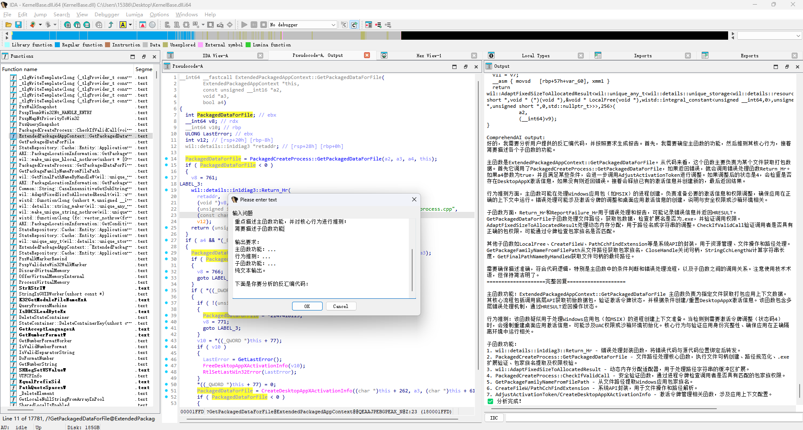
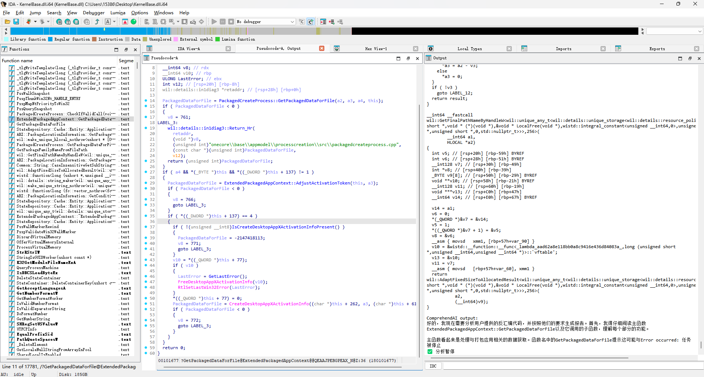

# ComprehendAI

一个用于辅助 IDA 逆向分析的 AI 插件，可以快速总结代码功能，加速分析效率。

> **🎉 重大更新 v2.0（2025-10-24）**: 
> - ✨ 新增智能缓存系统 - 自动缓存分析结果，节省API调用
> - ✨ 新增结果导出功能 - 一键导出Markdown格式报告
> - ✨ 新增5种专业分析模板 - 安全审计、漏洞扫描、算法识别等
> - ✨ 新增代码上下文提取 - 自动提取字符串常量、数值常量
> - 🚀 大幅提升易用性和分析效率
>
> 详见 [NEW_FEATURES.md](./NEW_FEATURES.md) | [OPTIMIZATION_NOTES.md](./OPTIMIZATION_NOTES.md) | [CODE_COMPARISON.md](./CODE_COMPARISON.md)

## 功能特性

### 🆕 v2.0 新功能

#### 📦 智能缓存系统
- 自动缓存分析结果，避免重复分析
- 基于函数地址和代码内容的智能缓存
- 缓存有效期24小时，自动管理大小
- 节省API调用次数和费用

#### 💾 结果导出功能
- 一键导出Markdown格式分析报告
- 包含完整的函数信息和分析结果
- 支持自动导出模式
- 导出文件自动组织，便于管理

#### 🎯 5种专业分析模板
- **🤖 标准分析**：全面的代码功能分析
- **🔒 安全审计**：专注安全漏洞检测
- **🐛 漏洞扫描**：深度漏洞挖掘分析
- **🔍 算法识别**：识别加密和算法类型
- **⚡ 快速总结**：简洁的功能总结

#### 📊 代码上下文增强
- 自动提取函数中的字符串常量
- 提取关键数值常量（魔数、标志位等）
- 显示函数基本信息（大小、地址等）
- 帮助AI更准确理解代码功能

### 核心功能

### 🚀 非阻塞式 AI 分析
- 分析过程不会阻塞你的工作
- 分析完成后结果会自动打印到输出窗口
- 可随时停止正在运行的分析任务

### ⚙️ 可自定义的函数分析深度
- 灵活设置函数分析的递归深度
- 深度为 0 时只分析当前函数
- 深度越大，分析的子函数层级越多

### 💬 手动与 AI 交互
- 可以直接向 AI 提问
- 支持结合当前代码向 AI 提问
- 自由进行任何你想要的操作

### 📝 自定义提示词
- 支持自定义分析提示词模板
- 可根据不同需求调整分析重点

### 🌊 支持流式输出
- 支持使用具有流式输出功能的推理模型
- 实时获取 AI 的分析结果

## 安装使用

### 1. 克隆项目

首先，将项目克隆到本地：

```bash
git clone https://github.com/wang-zhibo/ComprehendAI.git
```

### 2. 放置文件

进入克隆的项目目录，找到 `ComprehendAI.py` 文件，将其放入 IDA 的 `plugins` 文件夹中。

```
path
cd /Applications/IDA\ Professional\ 9.2.app/Contents/MacOS/plugins
🦉 [plugins] cp ~/wangzhib_githubs/ComprehendAI/ComprehendAI.py .
```

**重要提示**：不要直接使用 `config_sample.json`，而是需要创建自己的 `config.json` 文件。

### 3. 配置文件设置

在 IDA 的 `plugins` 文件夹中创建一个新的 `config.json` 文件，内容格式如下：

```json
{
    "openai": {
        "model": "你的模型名称",
        "api_key": "你的API密钥",
        "base_url": "你的API地址"
    }
}
```

**配置示例：**

使用 OpenAI 官方 API：
```json
{
    "openai": {
        "model": "gpt-4",
        "api_key": "sk-xxxxxxxxxxxxxxxx",
        "base_url": "https://api.openai.com/v1"
    }
}
```

使用其他兼容 OpenAI 格式的 API（如 DeepSeek、通义千问等）：
```json
{
    "openai": {
        "model": "deepseek-chat",
        "api_key": "你的API密钥",
        "base_url": "https://api.deepseek.com/v1"
    }
}
```

使用本地 Ollama：
```json
{
    "openai": {
        "model": "qwen2.5:14b",
        "api_key": "ollama",
        "base_url": "http://localhost:11434/v1"
    }
}
```

### 4. 安装依赖

安装所需的 Python 库：

```bash
pip install openai
```

### 5. 启动 IDA 并加载插件

插件已在 IDA 9.1 和 IDA 7.7 上成功测试。

启动 IDA 后，插件会自动加载。如果加载成功，你会在输出窗口看到：

```
================================================================================
✅ ComprehendAI 插件已成功加载
================================================================================
```

## 使用方法

### 📋 完整菜单

右键点击函数后，在 `ComprehendAI` 子菜单中可以看到以下选项：

```
ComprehendAI/
├── 🤖 AI 智能分析       # 标准全面分析
├── 🔒 安全审计           # 安全漏洞审计
├── 🐛 漏洞扫描           # 深度漏洞扫描
├── 🔍 算法识别           # 识别加密算法
├── ⚡ 快速总结           # 快速功能总结
├── ─────────────────
├── 💬 带代码提问         # 结合代码自定义提问
├── 💭 直接提问           # 不带代码提问
├── ─────────────────
├── 💾 导出结果           # 导出上次分析结果
├── 📤 自动导出           # 切换自动导出
├── ─────────────────
├── 🔄 切换缓存           # 启用/禁用缓存
├── 🗑️ 清空缓存           # 清除所有缓存
├── ─────────────────
├── ⚙️ 分析深度           # 设置递归深度
├── 📝 自定义提示词       # 自定义提示词模板
└── 🛑 停止               # 停止当前任务
```

### 1. 基础分析功能

#### 🤖 AI 智能分析

标准的全面代码分析，适合初次分析函数。

**使用方法**：
- 右键点击函数 → `ComprehendAI` → `🤖 AI 智能分析`

**输出内容**：
- 函数上下文信息（名称、地址、大小、字符串、常量）
- 主函数功能说明
- 关键逻辑分析
- 子函数功能说明


#### 🔒 安全审计

专注于安全漏洞检测，适合安全审计场景。

**检测内容**：
- 缓冲区溢出风险
- 整数溢出/下溢
- 空指针解引用
- 未初始化变量
- 格式化字符串漏洞
- 竞态条件
- 不安全的API调用

**使用方法**：
- 右键点击可疑函数 → `ComprehendAI` → `🔒 安全审计`

#### 🐛 漏洞扫描

深度漏洞挖掘分析，给出可利用性评估。

**扫描内容**：
- CVE类型漏洞
- 内存安全问题
- 逻辑漏洞
- 权限绕过
- 注入攻击向量

**使用方法**：
- 右键点击函数 → `ComprehendAI` → `🐛 漏洞扫描`

#### 🔍 算法识别

识别代码中使用的加密、哈希、编码等算法。

**识别范围**：
- 加密算法（AES, RSA, DES等）
- 哈希算法（MD5, SHA系列等）
- 压缩算法
- 编码算法（Base64等）
- 自定义算法特征

**使用方法**：
- 右键点击加密相关函数 → `ComprehendAI` → `🔍 算法识别`

#### ⚡ 快速总结

用2-3句话快速总结函数功能，适合快速浏览代码。

**使用方法**：
- 右键点击函数 → `ComprehendAI` → `⚡ 快速总结`

**优势**：
- 速度快
- Token消耗少
- 快速了解大致功能

### 2. 设置分析深度

右键选择 `ComprehendAI` -> `⚙️ 设置分析深度`。

- **深度 0**：只分析当前函数，不包含子函数（节省 token）
- **深度 1**：分析当前函数及其直接调用的子函数
- **深度 2**（默认）：分析当前函数、子函数及子函数的子函数
- 以此类推...


### 3. 自定义查询

#### 💬 带代码提问

结合当前函数代码向AI提问，适合针对性分析。

**使用方法**：
1. 右键点击函数 → `ComprehendAI` → `💬 带代码提问`
2. 输入你的问题

**适用场景**：
- "这个函数有什么安全漏洞吗？"
- "这段代码的时间复杂度是多少？"
- "帮我找出这个函数中的关键逻辑"
- "这个函数是否存在内存泄漏？"


#### 💭 直接提问

直接向AI提问，不附带代码。

**使用方法**：
1. 右键任意位置 → `ComprehendAI` → `💭 直接提问`
2. 输入问题

**适用场景**：
- "解释一下 ROP 攻击的原理"
- "什么是栈溢出？"
- "如何识别XOR加密？"
- 任何逆向分析相关的问题

### 4. 结果管理

#### 💾 导出结果

将上次分析结果导出为Markdown格式报告。

**使用方法**：
- 分析完成后 → 右键 → `ComprehendAI` → `💾 导出结果`

**导出位置**：
```
IDA插件目录/comprehendai_exports/函数名_地址_时间戳.md
```

**文件内容**：
- 函数基本信息
- 完整分析结果
- 反编译代码（可选）

#### 📤 自动导出

开启后，每次分析完成自动导出结果。

**使用方法**：
- 右键 → `ComprehendAI` → `📤 自动导出`（切换开关）

**适用场景**：
- 批量分析多个函数
- 需要保存所有分析记录
- 生成分析报告

### 5. 缓存管理

#### 🔄 切换缓存

启用或禁用结果缓存功能。

**使用方法**：
- 右键 → `ComprehendAI` -> `🔄 切换缓存`

**缓存特性**：
- 默认启用
- 基于函数地址和代码内容
- 有效期24小时
- 自动管理大小（最多100条）

**优势**：
- ✅ 节省API调用费用
- ✅ 即时显示缓存结果
- ✅ 提高分析效率

#### 🗑️ 清空缓存

清除所有缓存数据。

**使用方法**：
- 右键 → `ComprehendAI` -> `🗑️ 清空缓存`

**何时清空**：
- 代码修改后需要重新分析
- 缓存数据过多占用空间
- 分析模板更新后

### 6. 配置选项

#### ⚙️ 分析深度

设置函数分析的递归深度。

**使用方法**：
- 右键 → `ComprehendAI` -> `⚙️ 分析深度`

**深度说明**：
- **深度 0**：只分析当前函数（最快，最省Token）
- **深度 1**：分析当前函数 + 直接调用的子函数
- **深度 2**（默认）：分析两层子函数
- **深度 3+**：深度分析（耗时，消耗大量Token）


#### 📝 自定义提示词

修改默认的分析提示词模板。

**使用方法**：
1. 右键 → `ComprehendAI` → `📝 自定义提示词`
2. 编辑提示词
3. 保存

**适用场景**：
- 针对特定项目自定义分析要求
- 调整AI分析重点
- 添加项目特定的上下文信息



### 7. 控制选项

#### 🛑 停止

停止当前正在运行的AI任务。

**使用方法**：
- 分析过程中 → 右键 → `ComprehendAI` → `🛑 停止`



## 输出示例

### 标准分析输出

```
================================================================================
ComprehendAI 输出:
================================================================================

📝 正在提取反汇编代码...
🚀 AI 任务已启动...

================================================================================
函数上下文信息
================================================================================
函数名: encrypt_data
地址: 0x401500
大小: 256 字节

发现的字符串 (3 个):
  1. "AES-256-CBC"
  2. "/dev/urandom"
  3. "encryption_key.bin"

关键常量 (5 个):
  0x100, 0x200, 0x400, 0x800, 0x1000

[AI 的思考过程和分析结果会流式输出...]

====================完整回复====================

**主函数功能**：
这是一个加密函数，使用 AES-256-CBC 模式对数据进行加密。
函数从文件读取密钥，使用随机IV进行加密操作。

**关键逻辑**：
1. 调用 load_encryption_key() 从文件加载256位密钥
2. 调用 generate_iv() 生成随机初始化向量
3. 初始化 AES 上下文并设置加密参数
4. 对输入数据进行分块加密处理
5. 返回加密后的数据和IV

**子函数功能**：
- load_encryption_key: 从指定文件读取加密密钥
- generate_iv: 使用/dev/urandom生成随机IV
- init_aes_context: 初始化AES加密上下文
- aes_encrypt_block: 执行单个数据块的加密

================================================================================
✅ 分析完成！
================================================================================
```

### 安全审计输出

```
====================完整回复====================

**安全风险等级**：高

**发现的问题**：
1. 缓冲区溢出风险（高危）
   - 位置：encrypt_data+0x45
   - 描述：使用strcpy复制用户输入，未检查长度
   - 影响：可能导致栈溢出

2. 密钥管理不当（中危）
   - 位置：load_encryption_key函数
   - 描述：密钥明文存储在文件中
   - 影响：密钥可能被窃取

3. 未检查返回值（低危）
   - 位置：generate_iv+0x12
   - 描述：read()系统调用的返回值未检查
   - 影响：可能使用未初始化的IV

**建议修复方案**：
1. 使用strncpy或memcpy替代strcpy，并验证长度
2. 考虑使用密钥派生函数（KDF）
3. 添加返回值检查和错误处理

================================================================================
✅ 分析完成！
================================================================================
```

### 算法识别输出

```
====================完整回复====================

**识别到的算法**：
1. 算法名称：AES-256-CBC
   算法类型：对称加密算法
   用途推测：数据加密存储或传输
   特征依据：密钥长度256位，使用CBC模式

2. 算法名称：PKCS#7 Padding
   算法类型：填充算法
   用途推测：确保加密数据块对齐
   特征依据：填充字节值等于填充长度

**算法特征**：
- 使用openssl库的AES实现
- CBC模式需要IV（已检测到IV生成）
- 密钥管理独立实现
- 未检测到密钥派生函数

================================================================================
✅ 分析完成！
================================================================================
```

### 快速总结输出

```
====================完整回复====================

这是一个AES-256加密函数，负责从文件读取密钥，生成随机IV，
然后对输入数据进行分块加密。函数使用CBC模式，存在潜在的
缓冲区溢出风险。

================================================================================
✅ 分析完成！
================================================================================
```

## 常见问题

### Q: 提示 "配置文件不存在" 怎么办？
A: 确保在 IDA 的 plugins 文件夹中创建了 `config.json` 文件（不是 `config_sample.json`）。

### Q: 提示 "配置文件缺少 xxx 配置项" 怎么办？
A: 检查你的 `config.json` 文件，确保包含 `openai` 下的 `model`、`api_key` 和 `base_url` 三个字段。

### Q: AI 分析失败怎么办？
A: 
1. 检查网络连接
2. 检查 API 密钥是否正确
3. 检查 API 地址是否正确
4. 查看输出窗口的详细错误信息

### Q: 如何节省 token？
A: 将分析深度设置为 0，这样只会分析当前函数，不包含子函数。

### Q: 支持哪些 AI 模型？
A: 支持所有兼容 OpenAI API 格式的模型，包括：
- OpenAI GPT-4/GPT-3.5
- DeepSeek
- 通义千问
- 智谱 GLM
- Ollama 本地模型
- 其他兼容 OpenAI API 格式的模型

### Q: 可以在分析过程中继续使用 IDA 吗？
A: 可以！插件使用非阻塞式设计，分析过程不会影响你的正常工作。

### Q: 分析速度慢怎么办？
A: 
1. 使用流式输出的模型（如 GPT-4）可以实时看到结果
2. 减小分析深度
3. 使用本地模型（如 Ollama）

## 测试环境

- ✅ IDA Pro 9.2

```
mac ida pro 9.2 Python
 
/Applications/IDA\ Professional\ 9.2.app/Contents/MacOS/idapyswitch --force-path /Users/wzb/.pyenv/versions/3.11.10/lib/libpython3.11.dylib             15:06:38
```

## 技术特点

- **单例模式**：配置管理器使用单例模式，避免重复加载
- **线程安全**：使用锁机制保证线程安全
- **非阻塞设计**：使用独立线程处理 AI 请求
- **异常处理**：完善的异常处理机制，避免插件崩溃
- **流式输出**：支持流式接收 AI 响应，实时显示结果

## 贡献

欢迎提交 Issue 和 Pull Request！

## 许可证

MIT License

## 致谢

感谢所有使用和支持 ComprehendAI 的用户！

